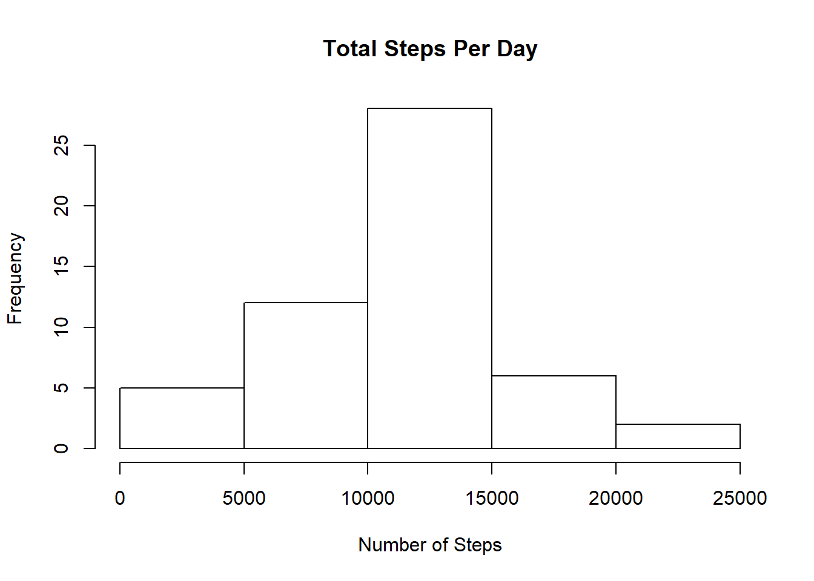
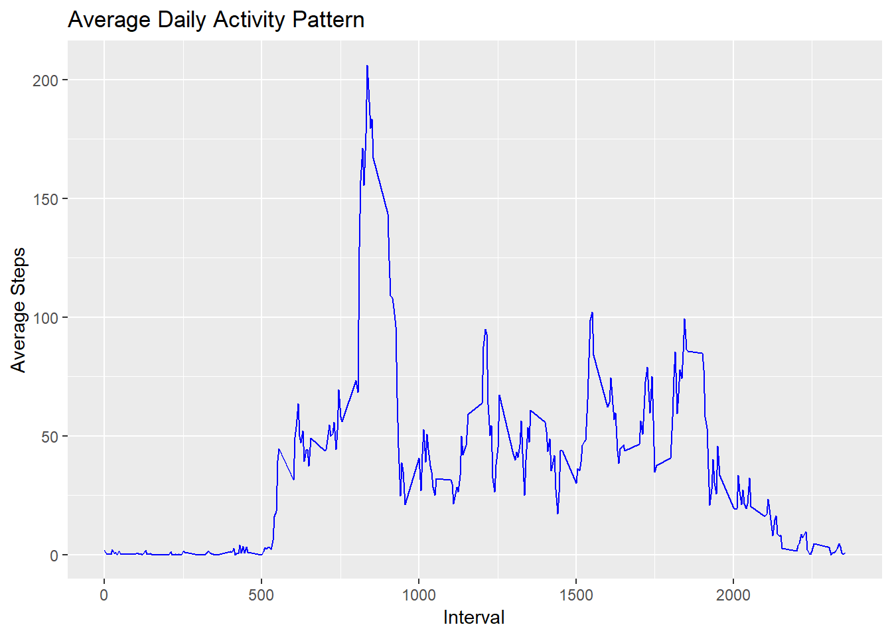
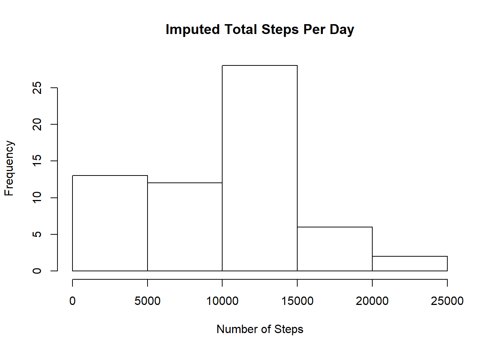
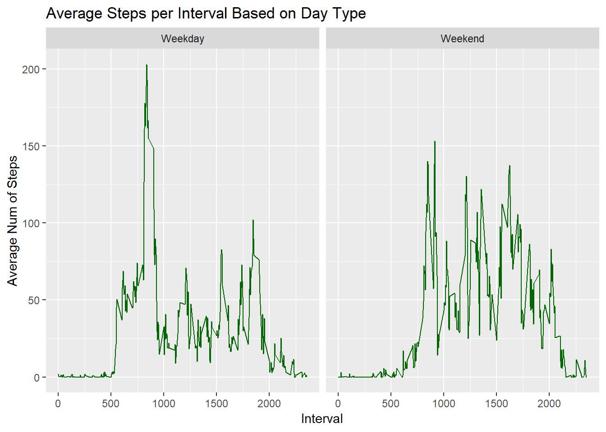

###Load the data set to be evaluated

```r
download.file(url="https://d396qusza40orc.cloudfront.net/repdata%2Fdata%2Factivity.zip", destfile = "ActivityData.zip",method = "curl")
unzip(zipfile="ActivityData.zip")
activity <- read.csv("activity.csv")
str(activity)
```

```
## 'data.frame':	17568 obs. of  3 variables:
##  $ steps   : int  NA NA NA NA NA NA NA NA NA NA ...
##  $ date    : Factor w/ 61 levels "2012-10-01","2012-10-02",..: 1 1 1 1 1 1 1 1 1 1 ...
##  $ interval: int  0 5 10 15 20 25 30 35 40 45 ...
```

###Calculate the total number of steps taken per day
###For this part of the assignment, you can ignore the missing values in the dataset.
#####(1)Calculate the total number of steps taken per day - displaying the first ten rows

```r
NoNAactivity <- activity[!is.na(activity$steps),]
TotalStepsPerDay <- aggregate(NoNAactivity$steps, list(NoNAactivity$date), sum)
colnames(TotalStepsPerDay) <- c("Date", "Steps")
head(TotalStepsPerDay, 10)
```

```
##          Date Steps
## 1  2012-10-02   126
## 2  2012-10-03 11352
## 3  2012-10-04 12116
## 4  2012-10-05 13294
## 5  2012-10-06 15420
## 6  2012-10-07 11015
## 7  2012-10-09 12811
## 8  2012-10-10  9900
## 9  2012-10-11 10304
## 10 2012-10-12 17382
```

#####(2)Make a histogram of the total number of steps taken each day

```r
hist(TotalStepsPerDay$Steps, xlab="Number of Steps", main="Total Steps Per Day")
```

<!-- -->

#####(3)Calculate and report the mean and median of the total number of steps taken per day

```r
mean(TotalStepsPerDay$Steps)
```

```
## [1] 10766.19
```

```r
median(TotalStepsPerDay$Steps)
```

```
## [1] 10765
```

###What is the average daily activity pattern?
#####(1)Make a time series plot of the 5-minute interval (x-axis) and the average number of steps taken, averaged across all days (y-axis)

```r
StepsPerInterval <- aggregate(steps~interval, NoNAactivity, mean)
StepsPerIntervalPlot <- ggplot(StepsPerInterval, aes(interval, steps))+geom_line(color="blue")+xlab("Interval")+ylab("Average Steps")+ggtitle("Average Daily Activity Pattern")
StepsPerIntervalPlot
```

<!-- -->

#####(2)Which 5-minute interval, on average across all the days in the dataset, contains the maximum number of steps?

```r
MaxSteps <- max(StepsPerInterval$steps)
StepsPerInterval[StepsPerInterval$steps==MaxSteps,1]
```

```
## [1] 835
```

###Imputing missing values
####Note that there are a number of days/intervals where there are missing values (coded as NA). The presence of missing days may introduce bias into some calculations or summaries of the data.
####(1) Calculate and report the total number of missing values in the dataset (i.e. the total number of rows with NAs)

```r
NumOfNAs <- sum(is.na(activity$steps))
NumOfNAs
```

```
## [1] 2304
```

###Devise a strategy for filling in all of the missing values in the dataset. The strategy does not need to be  sophisticated. For example, you could use the mean/median for that day, or the mean for that 5-minute interval, etc.
#####I am going to fill in the missing values by substituting 0 for the NA value.

####(3) Create a new dataset that is equal to the original dataset but with the missing data filled in.

```r
AvgNumSteps <- mean(NoNAactivity$steps)
activity[is.na(activity)]<- 0
NewTotalStepsPerDay <- aggregate(activity$steps, list(activity$date), sum)
colnames(NewTotalStepsPerDay) <- c("Date", "Steps")
head(NewTotalStepsPerDay, 10)
```

```
##          Date Steps
## 1  2012-10-01     0
## 2  2012-10-02   126
## 3  2012-10-03 11352
## 4  2012-10-04 12116
## 5  2012-10-05 13294
## 6  2012-10-06 15420
## 7  2012-10-07 11015
## 8  2012-10-08     0
## 9  2012-10-09 12811
## 10 2012-10-10  9900
```

#####(4) Make a histogram of the total number of steps taken each day and Calculate and report the mean and median total number of steps taken per day. Do these values differ from the estimates from the first part of the  assignment? What is the impact of imputing missing data on the estimates of the total daily number of steps?

```r
hist(NewTotalStepsPerDay$Steps, xlab="Number of Steps", main="Imputed Total Steps Per Day")
```

<!-- -->

```r
mean(NewTotalStepsPerDay$Steps)
```

```
## [1] 9354.23
```

```r
median(NewTotalStepsPerDay$Steps)
```

```
## [1] 10395
```

####Do these values differ from the estimates from the first part of the assignment? 
#####The original values for mean and median when removing NA values was 10766.19 and 10765 respectively. By substituting 0 in for the NA values the mean and median were 9354.23 and 10395 respectively, so yes the numbers were different.

####What is the impact of imputing missing data on the estimates of the total daily number of steps? 
#####It depends on what you do to impute the missing data as to the total impact on the daily number of steps but mine greatly decreased both. I ran it also by substituting the average number of steps in and the change was almost imperceptible.

###Are there differences in activity patterns between weekdays and weekends?
###For this part the weekdays() function may be of some help here. Use the dataset with the filled-in missing values for this part.
####(1) Create a new factor variable in the dataset with two levels - "weekday" and "weekend" indicating whether a given date is a weekday or weekend day.

```r
DayofWeek <- weekdays(as.Date(activity$date))
activityDayofWeek <- cbind(activity, DayofWeek)
DayType <- ifelse((DayofWeek == "Saturday"| DayofWeek== "Sunday"), "Weekend", "Weekday")
ActivityComplete <- cbind(activityDayofWeek, DayType)
head(ActivityComplete, 10)
```

```
##    steps       date interval DayofWeek DayType
## 1      0 2012-10-01        0    Monday Weekday
## 2      0 2012-10-01        5    Monday Weekday
## 3      0 2012-10-01       10    Monday Weekday
## 4      0 2012-10-01       15    Monday Weekday
## 5      0 2012-10-01       20    Monday Weekday
## 6      0 2012-10-01       25    Monday Weekday
## 7      0 2012-10-01       30    Monday Weekday
## 8      0 2012-10-01       35    Monday Weekday
## 9      0 2012-10-01       40    Monday Weekday
## 10     0 2012-10-01       45    Monday Weekday
```

####(2)Make a panel plot containing a time series plot of the 5-minute interval (x-axis) and the average number of steps taken, averaged across all weekday days or weekend days (y-axis). 

```r
AvgStepsPerDayType <- aggregate(steps~interval+DayType, ActivityComplete, mean)
AvgStepsPerDayTypePlot <- ggplot(AvgStepsPerDayType, aes(interval, steps))+geom_line(col="#006600")+
  ggtitle("Average Steps per Interval Based on Day Type")+xlab("Interval")+ylab("Average Num of Steps")+
  facet_wrap(DayType~.)
AvgStepsPerDayTypePlot
```

<!-- -->
###Both plots have spikes around interval 500 but overall there are more steps on the weekend.
